# Edupro School Management System — First Class High School

**Academic Reporting + Billing Platform for IGCSE Schools**

An integrated school management system built on Frappe Framework v15, handling marks entry, report card generation, parent communication, and student fees — from data collection through approval workflow to final PDF delivery.

**Status:** Live with real production data for First Class High School — 491 students, 41 teachers, 13 classes, 25 subjects, real Term 1–2 2026 billing. MVP (Sprints 0–8) + Phases 2–3 (Finance, Bursar Portal, Student/Parent Portal, Advanced Analytics) ✅ | Additional features in backlog

---

## 🎯 What This System Does

### For Students
- View personal report cards (grades, comments, position in class)
- Download/print report cards as PDF
- Profile tab showing class, subjects, and teacher assignments
- Secure portal access: `/my-reports`

### For Parents/Guardians
- View all linked children's reports in one place
- Track academic progress across terms
- View fee statements and payment status
- Receive email notifications when reports are published
- Download/print children's report cards

### For Teachers
- Enter marks (Term Mark + Exam Mark, each out of 100)
- Subject comments per student
- Dashboard showing assigned classes and marks progress
- Bulk CSV import/export for marks entry
- Website-based interface (no Desk access needed)

### For Class Teachers
- Review all students' marks for their class
- Add class-level comments on student reports
- Approve report cards for publication
- View class rankings and performance analytics

### For Headmaster
- Approve/reject all report cards
- Bulk actions (approve entire classes at once)
- School-wide dashboard: summary, class performance, student rankings
- Drill-down analysis per class
- Fee management and tracking
- Website-based dashboard interface

### For Bursar
- Bursar portal (`/bursar`, `/bursar-students`, `/bursar_fees`, `/bursar_billing`, `/import-data`) — no Desk access needed
- Create/enroll/deactivate students, link guardians (new or existing)
- Bulk CSV import for students (with validation report + downloadable template)
- Batch bill an entire term by boarding type in one action
- Record payments and adjust fee amounts inline, per student
- Generate fee statements (ledger-based)

---

## 📸 Screenshots

| | |
|---|---|
| 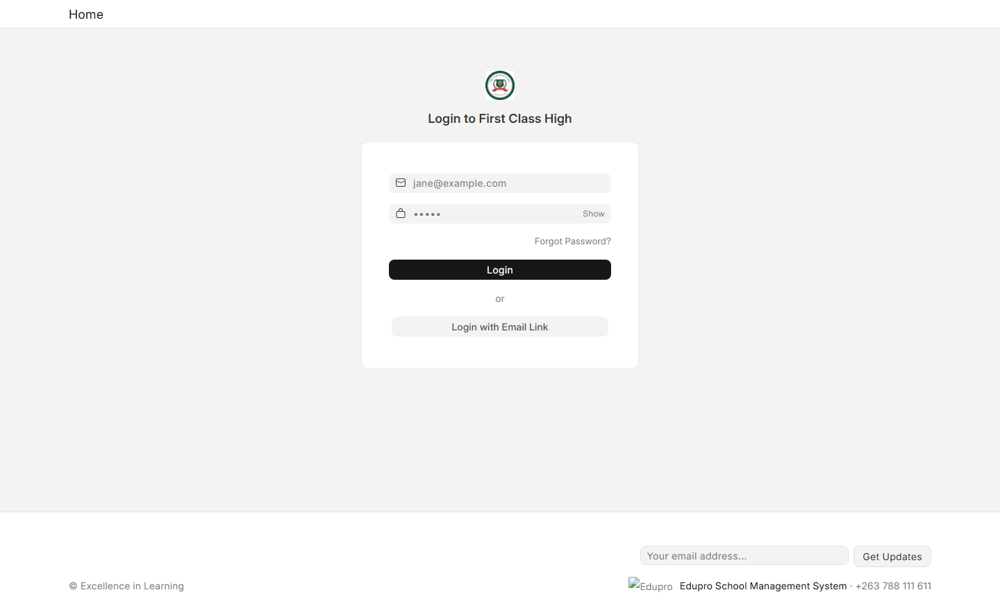 Login | 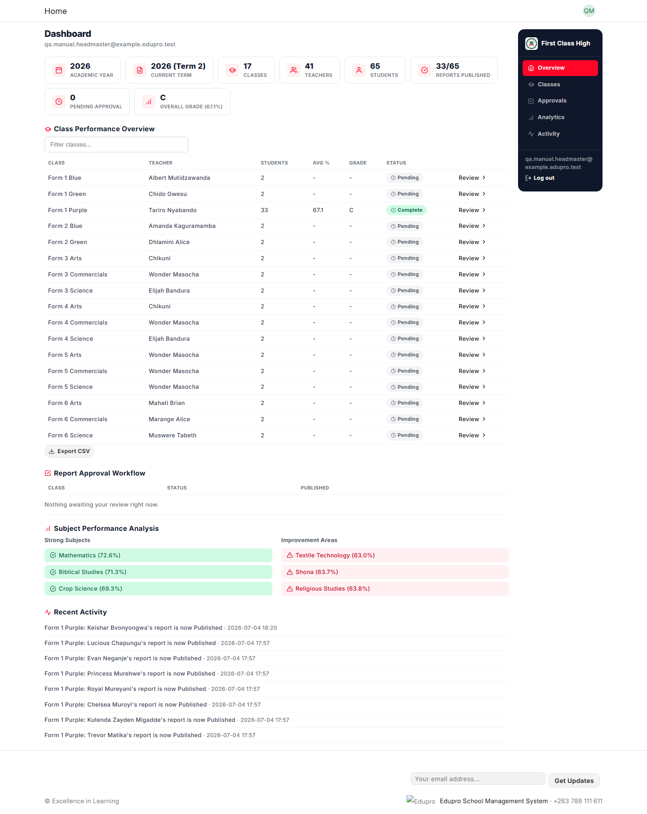 Headmaster Dashboard |
| 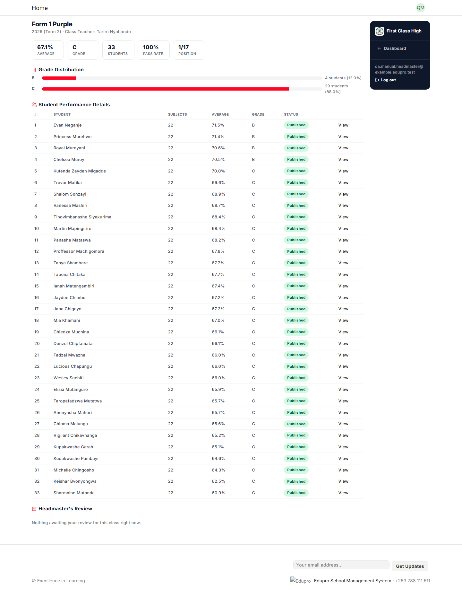 Class Review | 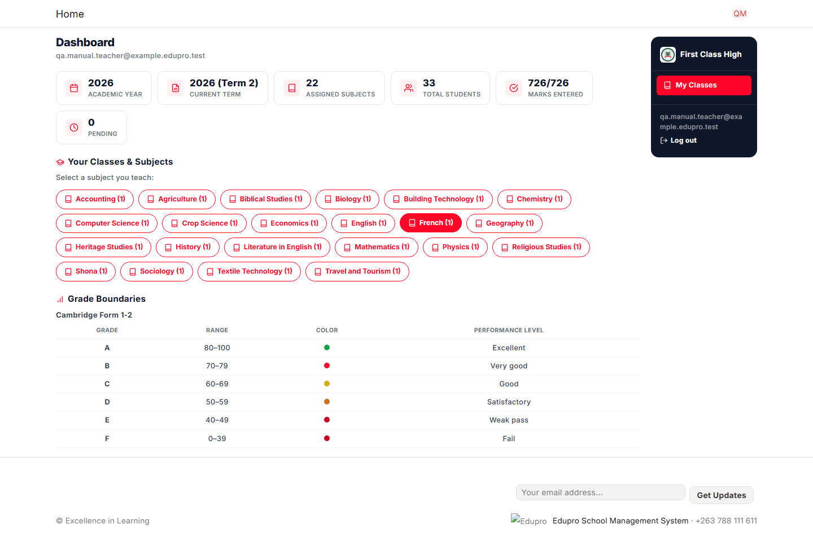 Teacher Dashboard |
| 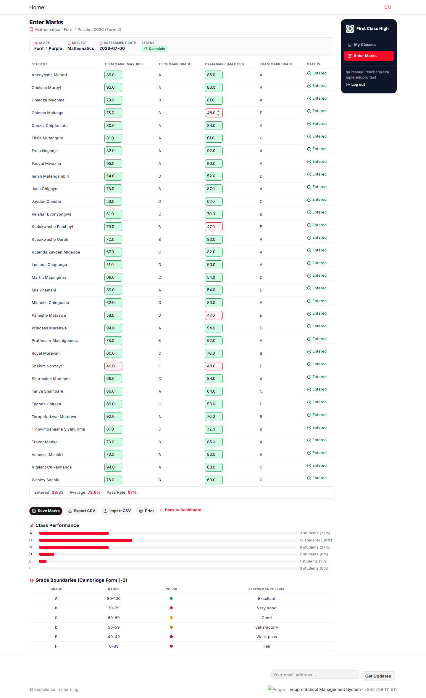 Marks Entry | 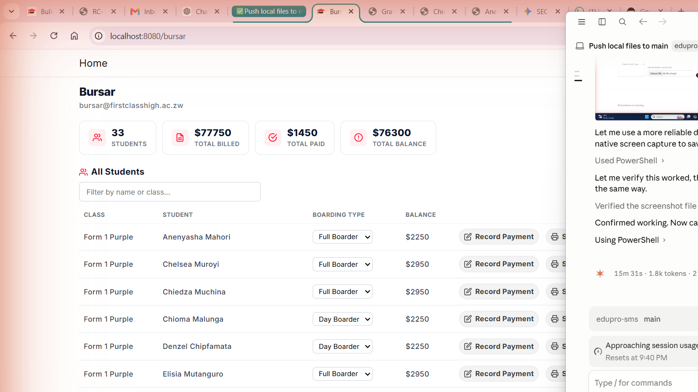 Bursar Dashboard |
| 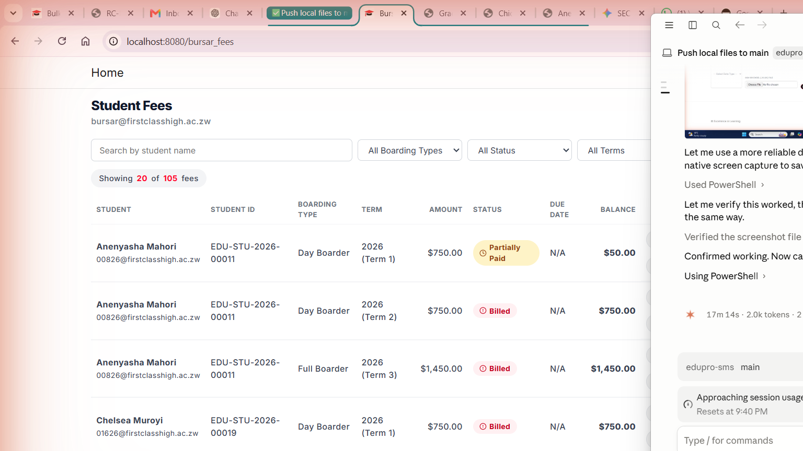 Bursar Fees | 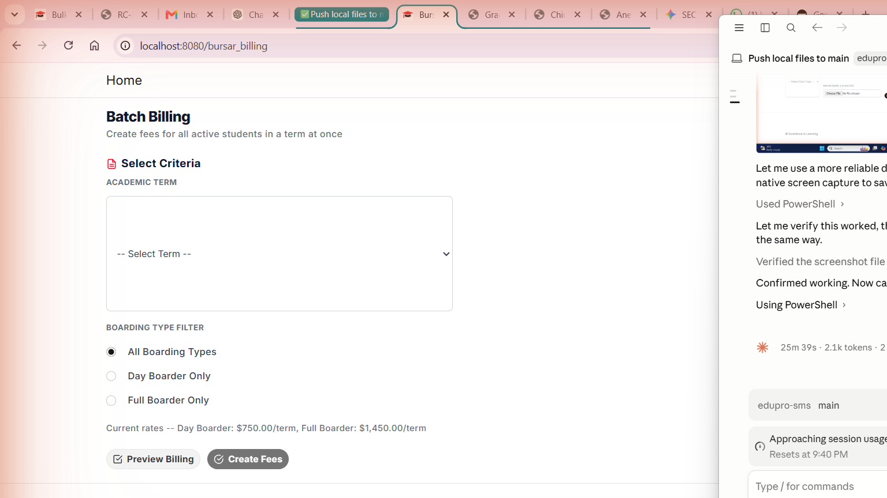 Bursar Billing |
| 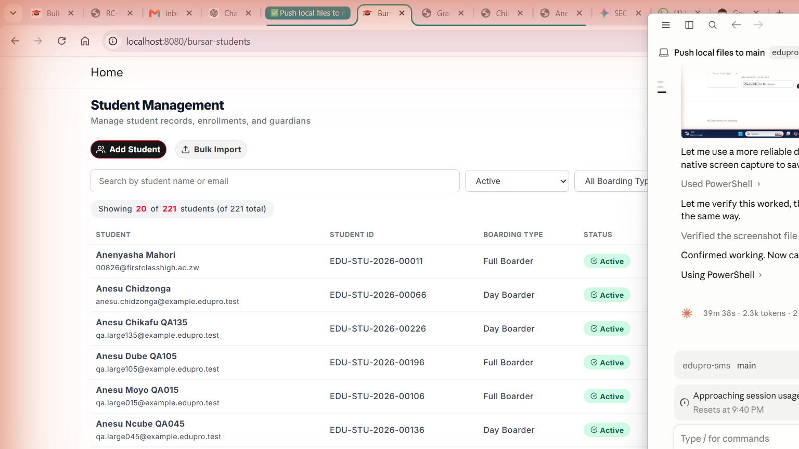 Bursar Students | 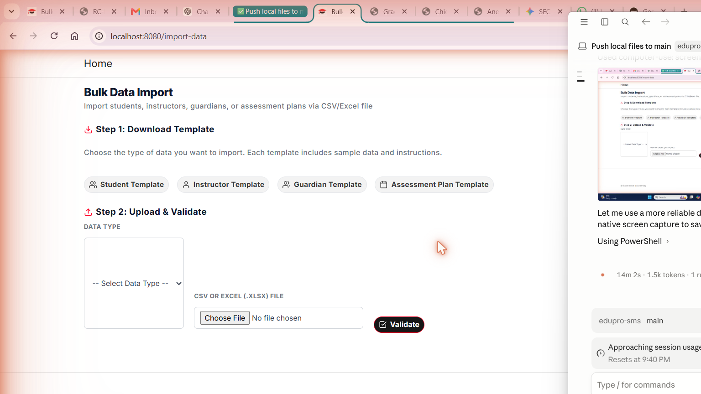 Bulk Import |
| 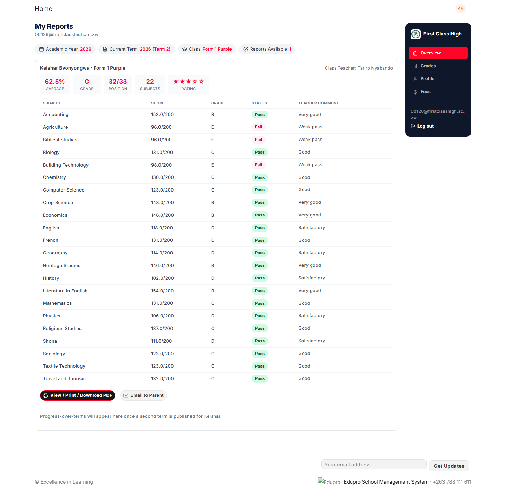 Student/Parent Portal | 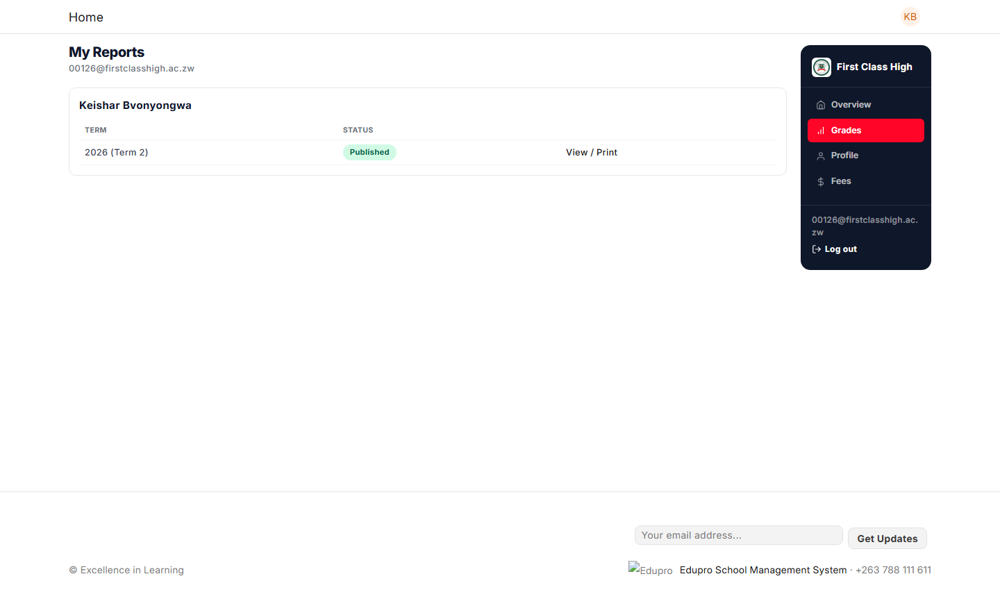 Grades View |
| 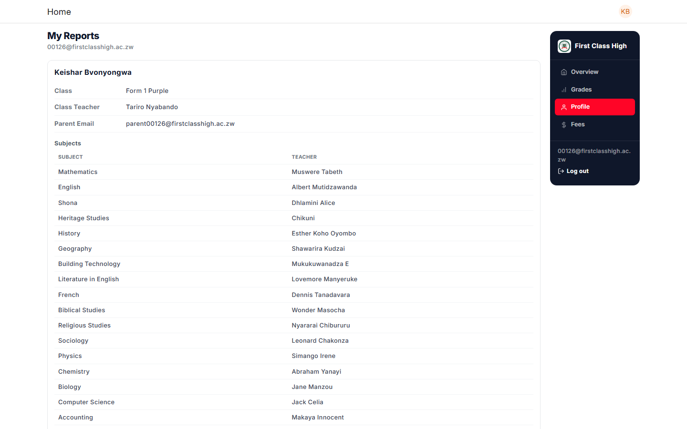 Profile | 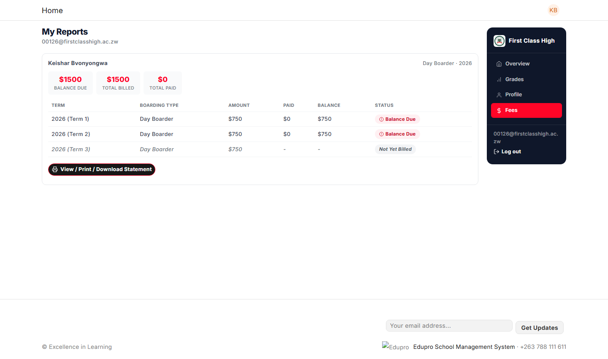 Portal Fees View |
| 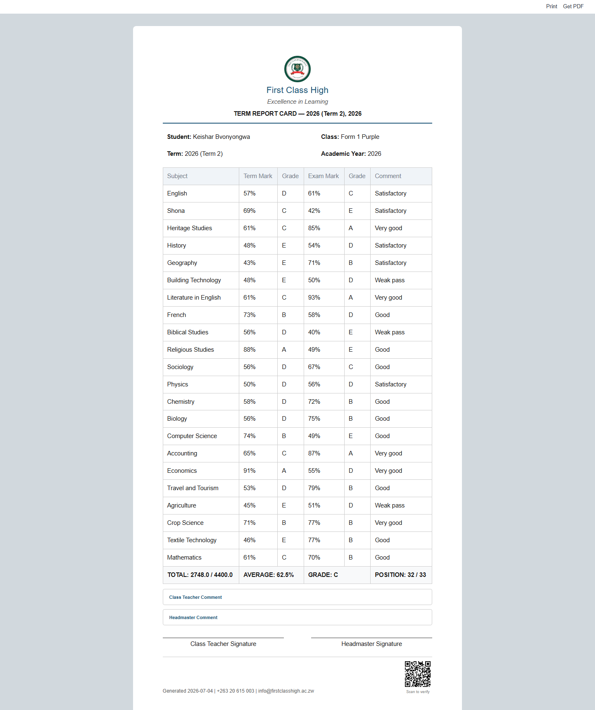 Report Card PDF | 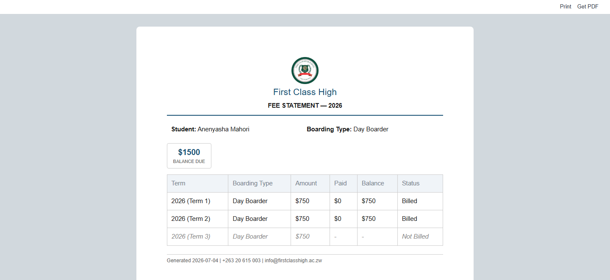 Fee Statement PDF |

---

## 🔑 Login Credentials

> ⚠️ **Real staff accounts, real passwords — not committed to this repo.**
> The database now holds First Class High School's actual students, staff,
> and finance records. Credentials are distributed to staff as a
> standalone, non-versioned handout (see `Edupro_SMS_Staff_Login_Credentials.pdf`
> if present locally — **never commit that file**), not documented here.
> Usernames follow `{firstinitial}{surname}@firstclasshighclass.ac.zw`
> for staff and `{admission_number}@firstclasshigh.ac.zw` for students.

| Role | Lands on |
|------|----------|
| System Manager (`Administrator`) | Frappe Desk (`/app`) |
| Bursar | `/bursar` |
| Headmaster / Deputy Head | `/dashboard` |
| Instructor (Teacher) | `/dashboard` |
| Student | `/my-reports` |
| Guardian | `/my-reports` |

Login at `http://localhost:8080/login`. All non-Administrator roles are
website-portal-only (no Desk access) per the role permission design.

---

## ✅ What's Been Built

### Core Academic Reporting (✅ Complete)
- **Marks Entry** — Teachers submit marks per subject per assessment plan
- **Multi-Step Approval** — Teacher → Class Teacher review → Headmaster approve/reject → Publish
- **Report Card Generation** — Automatic aggregation of marks across subjects with position ranking
- **PDF Export** — IGCSE-branded report cards with QR code verification
- **Parent Email** — Automated email delivery on publish (template customizable)
- **Multi-Curriculum Support** — Cambridge/ZIMSEC, Forms 1-2/O-Level/A-Level with distinct grading scales
- **Special Cases** — Absent/Exempt/Medical Withdrawal handling in calculations

### Portal Access (✅ Complete)
- **Student Portal** — `/my-reports` (secure, login required)
- **Parent Portal** — `/my-reports` (view all linked children, grouped)
- **Print/Download** — Direct PDF generation from portal
- **No Desk Access** — Students/Parents/Teachers see only portal UI, not admin interface

### Financial Module (✅ Complete)
- **Termly Billing** — Flat-rate fees determined by boarding type (Day/Full)
- **Batch Billing** — Bill an entire term's students in one action, filtered by boarding type, with a live preview before committing
- **Payment Tracking** — Ledger-based accounting (Debit/Credit/Balance per event)
- **Fee Statements** — Printable ledger showing all historical transactions
- **Status Tracking** — Billed / Partially Paid / Paid
- **Portal View** — Students/Parents can see fees and payment status

### Bursar Portal (✅ Complete)
- **Student Management** (`/bursar-students`) — create, enroll, deactivate students; link new or existing guardians
- **Bulk CSV Import** (`/import-data`) — real multipart upload, validation report, downloadable templates for Students/Guardians/Assessment Plans
- **Fee Entry** (`/bursar_fees`) — filter by boarding type/status/term, record payments and adjust fee amounts inline
- **Batch Billing** (`/bursar_billing`) — preview + commit termly billing runs
- All four built on the shared `portal_base.html` design system — no Desk access needed for any bursar task

### Dashboards (✅ Complete)
- **Teacher Dashboard** — Assigned classes/subjects, marks entry progress, grade distribution
- **Headmaster Dashboard** — School summary, class performance table, pending approvals, bulk actions
- **Advanced Analytics** — Academic trend analysis, at-risk student detection, grade predictions
- **Branding** — School name/logo/motto on login page and report cards

### Data & Configuration (✅ Complete)
- **Multi-Tenancy** — One Frappe site per school (isolated databases)
- **Academic Structure** — Academic Years, Terms, Classes, Subjects, Curricula
- **Role-Based Access** — System Manager, Headmaster, Bursar, Teacher, Class Teacher, Student, Guardian
- **Permissions** — Row-level access control (teachers see only their classes, students see only own reports)

---

## 🏗️ Architecture Overview

### Technology Stack
- **Framework:** Frappe v15.113.4 (Python 3.11.15)
- **Database:** MariaDB (default Frappe)
- **Cache/Jobs:** Redis + RQ
- **Frontend:** Frappe Desk (admin) + Custom website pages (portal)
- **Deployment:** Docker (dev), containerized (production)

### Project Structure
```
edupro-sms/
├── .claude/                          # AI development guidance
│   ├── CLAUDE.md                     # Project rules & index
│   ├── TASKS.md                      # Sprint plan & backlog
│   ├── DECISIONS.md                  # Architecture decisions (0001–0020)
│   ├── CHANGELOG.md                  # Dated change log
│   └── CODING_STANDARDS.md           # Code conventions
├── docs/                             # Technical specifications (source of truth)
│   ├── 01_Project_Overview.md        # MVP scope, success metrics
│   ├── 02_Database.md                # Entity relationships, multi-tenancy
│   ├── 03_DocTypes.md                # All DocType specs, fields, grading rules
│   ├── 04_Workflows.md               # Approval workflow state machine
│   ├── 05_Print_Formats.md           # Report card & fee statement layouts
│   ├── 06_Email_System.md            # Email templates, triggers
│   ├── 07_Testing.md                 # Test scenarios, UAT checklist
│   ├── 08_Deployment.md              # Performance targets, checklist
│   ├── 09_API.md                     # API/auth conventions
│   ├── 10_User_Guide.md              # End-user walkthroughs
│   ├── 11_Roles_And_Permissions.md   # Role matrix, capabilities
│   └── 12_Finance_Billing.md         # Finance system spec
├── apps/edupro_sms/                  # Custom Frappe app (main source code)
│   ├── edupro_sms/doctype/           # DocTypes (Report Card, Student Fee, etc.)
│   ├── edupro_sms/www/               # Website pages (/dashboard, /marks-entry, /my-reports)
│   ├── edupro_sms/print_format/      # Print templates (IGCSE Report Card, Fee Statement)
│   ├── edupro_sms/report/            # Desk reports (My Classes, etc.)
│   ├── edupro_sms/fixtures/          # Version-controlled config (roles, workflows, fields)
│   ├── *.py                          # Core logic (marks_entry, approvals, fees, permissions, etc.)
│   └── hooks.py                      # App initialization & event handlers
├── frappe_docker/                    # Docker setup (dev environment only, gitignored)
├── sites/                            # Frappe site data (gitignored, dev only)
└── README.md                         # This file
```

### Key DocTypes (Data Models)

**Academic:**
- **Assessment Plan** (Education) — Scheduled exam session + marking criteria (Term Mark/Exam Mark)
- **Assessment Result** (Education) — Marks submitted per student per plan
- **Report Card** (Custom) — Aggregated results + approval workflow
- **Class Subject Assignment** (Custom) — Class + Subject + Teacher mapping

**Finance:**
- **Student Fee** (Custom) — Termly billing record (one per student per term)
- **Student Ledger Entry** (Custom) — Ledger rows (bills & payments, timestamped)

**Configuration:**
- **School Settings** (Custom) — Per-site branding, curriculum board
- **Academic Year, Academic Term** (Education) — Calendar
- **Student Group** (Education) — Class
- **Course** (Education) — Subject
- **Program** (Education) — Stream (Science/Commerce/Arts)
- **Curriculum** (Custom) — Grading bands (Form 1-2, O-Level, A-Level)

---

## 🚀 Getting Started (Development Setup)

### Prerequisites
- Docker Desktop (Windows/Mac) or Docker Engine (Linux)
- Git
- Python 3.11 (for local tooling, optional)
- VS Code (recommended)

### Quick Start

1. **Clone the repo:**
   ```bash
   git clone git@github.com:ttshava/edupro-sms.git
   cd edupro-sms
   ```

2. **Start Docker containers:**
   ```bash
   cd frappe_docker
   docker compose up -d
   ```
   Wait for all services to be healthy (~2 min).

3. **Access the system:**
   - **Frappe Desk (admin):** http://localhost:8080
   - **Username:** `administrator`
   - **Password:** (check `frappe_docker/.env` or console output)

4. **Create test data (optional):**
   ```bash
   docker compose exec backend bench execute edupro_sms.admin_provisioning.setup_pilot_school
   ```

### Key Development Commands

```bash
# SSH into backend container
docker compose exec backend bash

# Run tests
bench run-tests --app edupro_sms

# Clear cache (after Python code changes)
bench clear-cache
docker compose restart backend queue-short queue-long scheduler websocket

# Bench console for debugging
bench console

# View logs
docker compose logs -f backend
```

**Important:** After modifying Python files, restart containers (not just `clear-cache`) — gunicorn workers cache imports.

---

## 📊 Current Status & Stages

### ✅ MVP Complete (Sprints 0–8)

| Sprint | Focus | Status |
|--------|-------|--------|
| **0** | Documentation & environment scaffolding | ✅ Done |
| **1** | Frappe v15 setup, Education app spike | ✅ Done |
| **2** | Roles, School Settings, Grading Scale | ✅ Done |
| **3** | Academic structure (Programs, Courses, Terms) | ✅ Done |
| **4** | People (Instructors, Students, Guardians) | ✅ Done |
| **5** | Assessments & marks entry | ✅ Done |
| **6** | Approval workflow & Report Card | ✅ Done |
| **7** | Portals, email delivery, permission scoping | ✅ Done |
| **8** | Dashboards, testing, MVP release | ✅ Done |

### ✅ Post-MVP Refinements (2026-07-03 onward)

| Item | Status | Notes |
|------|--------|-------|
| Marks simplified (single Exam/100) | ✅ Done 2026-07-04 | Reverted to Term Mark + Exam Mark |
| Class restructure (17 classes, 3 curricula) | ✅ Done 2026-07-04 | Form 1-4, U6; Cambridge/ZIMSEC |
| Teacher dashboard/marks entry rebrand | ✅ Done 2026-07-04 | Edupro design system applied |
| Headmaster dashboard redesign | ✅ Done 2026-07-04 | Class performance, approvals, analytics |
| Finance module (billing, ledger, fees) | ✅ Done 2026-07-04 | Flat-rate termly billing; payment tracking |
| Portal redesign (sidebar layout) | ✅ Done 2026-07-04 | Unified navigation for all roles |
| QR code authenticity | ✅ Done 2026-07-04 | Verification link on report cards |
| Documentation sync (docs/12 added) | ✅ Done 2026-07-05 | All features now documented |
| Real school data go-live | ✅ Done 2026-07-06 to 2026-07-09 | 491 real students, 41 real teachers, 13 real classes, real Term 1–2 2026 billing — all demo/sample data replaced |
| Headmaster/Deputy Head dashboard finance summary | ✅ Done 2026-07-09 | Revenue collected, outstanding balance by class, `docs/12_Finance_Billing.md` §12.10 |
| Marks-entry rollout across all real classes | ✅ Done 2026-07-09 | 171 Assessment Plans provisioned (previously zero existed) — `.claude/DECISIONS.md` 0021 |
| Teacher permission scoping fix | ✅ Done 2026-07-09 | Narrowed to exact (class, subject), was previously whole-class — `.claude/DECISIONS.md` 0021 |

### 🔄 Current Stage: **Live for First Class High School**

**What's ready:**
- ✅ All academic reporting workflows (entry → approval → publish)
- ✅ All portals (student, parent, teacher, headmaster)
- ✅ Billing system (create fees, track payments) — real data, real balances
- ✅ Email delivery (on publish)
- ✅ Multi-school support (separate Frappe sites)
- ✅ Role-based access control, scoped to exact class+subject (not just class)
- ✅ Real production data for First Class High School (491 students, 41 teachers)

**What needs before wider rollout:**
1. Browser-based UAT pass (documented checklist in `docs/07_Testing.md` §7.4)
2. Production deployment (AWS/GCP/self-hosted with proper backups) — currently local Docker dev only

> Real SMTP is configured and verified as of 2026-07-06 — `First Class
> High Outgoing` (`mail.firstclasshigh.ac.zw`), confirmed with a real
> end-to-end send (report card + PDF attachment, delivered).

### 📋 Backlog (lower priority)

| Item | Scope | Notes |
|------|-------|-------|
| Program Enrollment ↔ Student Group linkage | Batch-enroll doesn't auto-assign a Student Group | Known gap, flagged not fixed — separate child-table permission surface |
| Attendance system | Separate `edupro_attendance` app | Post-MVP, not in scope |
| SMS integration | Send alerts to parents | Post-MVP |
| Mobile apps | Native iOS/Android | Post-MVP |
| Advanced GL accounting | Charts of accounts, cost centers | Future `edupro_finance` app |

---

## 📚 Documentation Guide (For Developers)

**Start here:**
1. `.claude/CLAUDE.md` — Project rules, conventions, development workflow
2. `docs/01_Project_Overview.md` — System identity, scope, success metrics
3. `docs/02_Database.md` — Data model, multi-tenancy approach

**For implementation:**
- `docs/03_DocTypes.md` — Complete DocType specs (fields, relationships, grading rules)
- `docs/04_Workflows.md` — Approval workflow state machine
- `docs/05_Print_Formats.md` — Report card & fee statement layouts

**For features:**
- `docs/06_Email_System.md` — Email templates & triggers
- `docs/11_Roles_And_Permissions.md` — Role capabilities & permission matrix
- `docs/12_Finance_Billing.md` — Billing model, workflows, ledger tracking

**For operations:**
- `docs/07_Testing.md` — Test scenarios & UAT checklist
- `docs/08_Deployment.md` — Performance targets, deployment checklist, security
- `docs/10_User_Guide.md` — End-user walkthroughs per role

**For decisions:**
- `.claude/DECISIONS.md` — Architecture decisions (0001–0020) with rationale & gotchas
- `.claude/TASKS.md` — Sprint-by-sprint breakdown
- `.claude/CHANGELOG.md` — Dated changes per sprint

---

## 🔧 Common Development Tasks

### Adding a New Field to a DocType

1. Read `docs/03_DocTypes.md` to understand the current schema
2. Create a Custom Field in `apps/edupro_sms/fixtures/custom_field.json`
3. Test in Desk: **Customize Form** → add field → reload
4. Export fixture: `bench export-fixtures`
5. Commit fixture + update `docs/03_DocTypes.md` with the new field
6. Document in `.claude/DECISIONS.md` if it changes workflow

### Adding a New Role

1. Create in Desk: **Role** → New → set desk_access
2. Export fixture: `bench export-fixtures` → `apps/edupro_sms/fixtures/role.json`
3. Document in `docs/11_Roles_And_Permissions.md` (definition + matrix)
4. Add permission rules in Desk: **Role Permissions Manager**
5. Commit fixtures + docs

### Adding a New Website Page

1. Create folder: `apps/edupro_sms/edupro_sms/www/my-new-page/`
2. Create `index.html` (Jinja template) and optional `index.py` (get_context function)
3. Permissions: `has_permission()` function in `index.py` (must check role/context)
4. Test: restart backend, navigate to `/my-new-page`
5. Document in `docs/10_User_Guide.md` + reference in appropriate role section

### Running Tests

```bash
bench run-tests --app edupro_sms

# Specific test
bench run-tests --app edupro_sms edupro_sms.edupro_sms.doctype.report_card.test_report_card
```

Tests live in `apps/edupro_sms/edupro_sms/doctype/*/test_*.py`.

---

## 🐛 Troubleshooting

### "Module not found" error after code changes
**Problem:** Python files are cached in gunicorn workers.
**Solution:** Restart containers (not just `clear-cache`):
```bash
docker compose restart backend queue-short queue-long scheduler websocket
```

### Marks entry showing blank form
**Problem:** `special_case` custom field or permission not loaded.
**Solution:** Reload Desk (Ctrl+Shift+R) after restart, or check `has_permission()` in `marks_entry.py`.

### Email not sending
**Solution:** SMTP is configured (`First Class High Outgoing`) and verified working. If a send fails, check `Email Queue` (Desk) for the specific per-recipient error — the most common one in dev is `550 No Such User Here`, which means the recipient address isn't a real mailbox on `firstclasshigh.ac.zw` (true for most demo/sample guardian emails — only real addresses will actually receive mail).

### Student sees other students' reports
**Problem:** Row-level permissions not applied.
**Solution:** Check `has_permission()` + `get_permission_query_conditions()` in `report_card.py`; test over HTTP (not console).

### Report Card PDF shows "404 fetching CSS"
**Problem:** wkhtmltopdf can't reach frontend container.
**Solution:** Verify `bench set-config host_name "http://frontend:8080"` is set.

---

## 🎯 Development Workflow

**For each feature:**

1. **Read the spec** — Check relevant `docs/*` file
2. **Check DECISIONS.md** — See if similar work was done before
3. **Plan** — Explain your approach before coding (per `.claude/CLAUDE.md`)
4. **Implement** — Use Frappe best practices; commit to custom app only
5. **Test** — Run `bench run-tests`; test workflows over HTTP
6. **Document** — Update `.claude/CHANGELOG.md` + relevant `docs/*`
7. **Commit** — Clear message; mention DECISION.md entry if applicable
8. **Update TASKS.md** — Mark sprint item complete

**Code conventions:**
- PascalCase for DocType names
- snake_case for fieldnames, file names, app names
- Type hints where they clarify (not everywhere)
- Comments only for non-obvious **why**, not **what**
- Fixtures for all config (roles, workflows, custom fields) so they're version-controlled

---

## 📞 Getting Help

**For questions about the spec:**
- Check `docs/03_DocTypes.md` (data model)
- Check `docs/04_Workflows.md` (state machine)
- Check `.claude/DECISIONS.md` (why this way, not that)

**For questions about the codebase:**
- Use `grep` to find existing implementations (e.g., `grep -r "special_case" apps/`)
- Read `hooks.py` to see event handlers
- Check test files for usage examples

**For questions about setup/deployment:**
- See `docs/08_Deployment.md`
- Check `frappe_docker/overrides.local/compose.edupro-sms-app.yaml` (volume mounts, etc.)

---

## 📝 Recent Activity

**Latest (2026-07-09):** Real-data go-live corrections for First Class
High School. School Head/Deputy Head accounts added; Headmaster
dashboard gained a finance summary (revenue collected, outstanding
balance by class); marks entry rolled out for all 171 real class/subject
combinations (previously zero `Assessment Plan` records existed
anywhere — completely non-functional); fixed a real permission bug
where a teacher could enter marks for subjects they don't teach, and a
gap where a newly-assigned Class Teacher wasn't granted the role their
own class-review page requires. Full detail in `.claude/DECISIONS.md`
0021 and `.claude/CHANGELOG.md`.

**Previous (2026-07-05):** `apps/edupro_sms` committed to version control for the
first time (previously gitignored for the project's whole history), full
20+-commit app history preserved via `git subtree`. Shared portal design
system (`templates/portal_base.html`) extracted and rolled out to Fees,
Billing, Students, and Import Data. All four rebuilt on real schema (fixing
field-name mismatches against `Student`/`Guardian`/`Program Enrollment`/
`Academic Term`), with a working CSV bulk-import pipeline (the upload step
was previously a no-op) and two core Education-app permission gaps fixed
via `Custom DocPerm` fixtures.

**Previous:** `bd2b9b4` (2026-07-05) — docs/12_Finance_Billing.md added,
docs/03/04/05/11 synced with implemented features.

See `.claude/CHANGELOG.md` for the full dated change log.

---

## 📄 License

Per `license.txt` — (check file for specific license)

---

## 🔗 Quick Links

- **Main repo:** https://github.com/ttshava/edupro-sms
- **Technical specs:** `docs/` (start with `docs/01_Project_Overview.md`)
- **Development rules:** `.claude/CLAUDE.md`
- **Architecture decisions:** `.claude/DECISIONS.md`
- **Deployment guide:** `docs/08_Deployment.md`

---

**Welcome to Edupro SMS!** 🎓

This is a mature, well-documented codebase. Start with the docs, ask questions, and follow the conventions. The system is production-ready for real school deployments.
